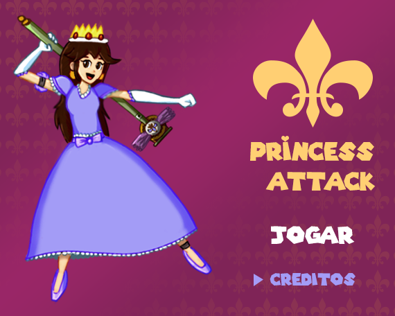

# PrincessAttack
**PrincessAttack** é um jogo ao estilo Mário desenvolvido num período de 1 mês e meio como trabalho para a conclusão da matéria **Hipermídia e Multimídia** do curso de **Sistemas para Internet** no **IFSP**.

## Sobre o jogo
O jogo **PrincessAttack** conta a história de uma princesa que teve seu reino invadido por um exército de robôs e sem a ajuda de ninguém precisa derrotar todos os robôs e reconquistar seu castelo.

## Sobre o projeto
Realizado no primeiro semestre de 2018, durante o terceiro módulo do curso, o projeto tinha como objetivo desenvolver um jogo usando conceitos e tecnologias de manipulação audiovisual e transformações gráficas ensinados em sala de aula.

A linguagem era de livre escolha de cada equipe e o uso de bibliotecas era opcional, esse jogo foi desenvolvido usando **Java** (pois era a linguagem usada em sala de aula) e não houve a utilização de nenhuma biblioteca de desenvolvimento de jogos ou framework.

O jogo deveria ser concluído em 1 mês e meio, como avaliação houve a apresentação do jogo e do código além de ser considerado também a opinião de outros estudantes como parte da nota final do projeto.

Após a apresentação, todos os membros ficaram com 10/10 de nota.

## Como jogar
Para jogar é recomendado o uso da IDE **NetBeans 8.1** ou versão superior, visto que outras IDEs não foram testadas e o arquivo executável não foi compilado.

Com o NetBeans instalado e após fazer o download/clone do jogo, abra o projeto e execute-o clicando no ícone **"play"** ou apertando **f5** no teclado.

Após isso o jogo será executado.

## Membros do projeto
João Passos
Leonardo Varzone
Matheus do Nascimento

## Créditos
Em grande parte do jogo foram usadas ou modificadas obras de terceiros, todas as que foram possível creditar a alguém estão abaixo.
### Músicas
* *Burning Town* do jogo Shantae de GameBoy Color;
* *Mario's Victory* do Super Smash Bros;
* *Flying Battery Zone* do jogo Sonic Mania;
* *Sign of Evil* do jogo Doom [E1M8].
### Sprites
* *Princess Peach* do Mario Party Advanced, ripado por: Winged Destiny.

## Futuro do projeto
Esse projeto **não** tem nenhuma intensão de se tornar um jogo real, ser comercializado ou servir como base para o desenvolvimento de outros jogos, ele está sendo mantido no Github como exposição apenas. Embora ele não tenha sido feito com esse objetivo, ele pode ser usado como base para outros jogos, ser modificado ou estudado por qualquer pessoa.

## Licensa
O código-fonte desse jogo pode ser usado livremente para qualquer fim por qualquer pessoa interessada, sem que seja obrigatório dar créditos, embora gostariamos que fossem dados os devidos créditos como reconhecimento do nosso trabalho.